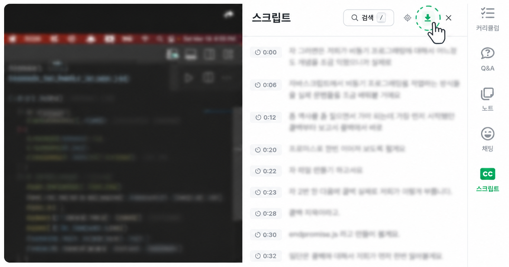

<div align="center">
  

  # 인프런 자막 다운로더

  인프런 강의 자막(스크립트)을 한 번에 복사하거나 텍스트 파일로 저장하는 Chrome 확장 프로그램

  [](https://chromewebstore.google.com/detail/ecgjffddcafmicbodajklpahahdkpike)
  [](LICENSE)

</div>

---

## 주요 기능

- 인프런 강의 스크립트 탭에 다운로드 버튼 자동 추가
- 자막 전체를 클립보드에 **복사** 또는 `.txt` 파일로 **다운로드**
- 별도의 API 호출 없이 강의 재생 중 발생하는 자막 응답만 로컬에서 캡처
- 어떠한 개인정보도 수집하거나 외부 서버로 전송하지 않음 ([개인정보처리방침](PRIVACY.md))

## 설치 방법

[Chrome 웹 스토어](https://chromewebstore.google.com/detail/ecgjffddcafmicbodajklpahahdkpike)에서 직접 설치할 수 있습니다.

<details>
<summary><b>수동 설치 (개발자용)</b></summary>

웹 스토어 버전이 아닌 최신 개발 버전을 사용하고 싶다면:

1. 이 저장소를 ZIP으로 다운로드 (GitHub 페이지 우측 상단 `Code → Download ZIP`)
2. ZIP 파일 압축 해제
3. Chrome 주소창에 `chrome://extensions` 입력
4. 우측 상단 **개발자 모드** 켜기
5. **압축해제된 확장 프로그램을 로드합니다** 클릭 → 압축 해제한 폴더 선택

> 로드한 폴더를 삭제하거나 이동하면 동작하지 않습니다.

[Chrome 공식 가이드 — 압축 해제된 확장 프로그램 로드](https://developer.chrome.com/docs/extensions/get-started/tutorial/hello-world?hl=ko#load-unpacked)

</details>

## 사용 방법



1. 인프런 강의 페이지에서 **스크립트** 탭 열기
2. 스크립트 탭 우측 상단에 나타난 다운로드 버튼(↓) 클릭
3. **전체 복사** 또는 **텍스트 다운로드** 선택

## 작동 방식

별도의 API 요청을 보내지 않습니다. 강의 재생 시 자막 API 응답을 캡처해 메모리에 임시 보관하며, 사용자가 버튼을 클릭할 때 파일로 저장합니다.

```
강의 재생 → 브라우저가 자막 API 요청 → 응답 캡처 → 다운로드 버튼 활성화
```

내부적으로 `window.fetch`를 오버라이드해 자막 URL(`vod.inflearn.com/.../subtitles/json`)에 해당하는 응답만 추출합니다. 자막 URL이 아닌 요청은 그대로 통과시키며, 임의로 API를 호출하거나 인증 정보에 접근하지 않습니다. 캡처된 자막은 외부 서버로 전송되지 않으며 브라우저 로컬에서만 처리됩니다.

권한은 `https://www.inflearn.com/*`으로만 제한되며, 다른 사이트에는 접근하지 않습니다.

## 주의사항

- 인프런과 무관한 **비공식 도구**입니다.
- **개인 학습 목적으로만** 사용하세요.
- 사용자가 정상적으로 수강 권한을 가진 강의에만 적용됩니다.
- 다운로드한 자막을 무단 배포하거나 상업적으로 이용하는 행위는 저작권 침해 및 인프런 이용약관에 위배될 수 있습니다.
- 인프런 사이트 업데이트에 따라 동작하지 않을 수 있습니다.

## 버그 제보 / 문의

[GitHub Issues](https://github.com/ICE0208/inflearn-subtitle-downloader/issues)에 남겨주세요.

## 라이선스

[MIT](LICENSE)
